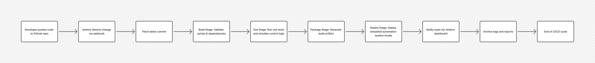

# industrial-automation-sim
A modular industrial automation simulation demonstrating Modbus, OPC UA, PID control logic, configuration management, and CI/CD integration.
# Industrial Automation Simulation
### A full-stack simulation of a Process Control System with Modbus TCP, OPC UA, PID Control, and CI/CD Integration

---

##  Overview
This project demonstrates how modern **industrial automation software** integrates **field communication protocols**, **control logic**, and **data exchange layers** under a **continuous integration (CI/CD)** workflow.

It emulates how a **PLC**, **HMI**, and **process control logic** interact in a real-world industrial environment.

---

## ⚙️ System Architecture

###  Components
| Layer | Technology | Purpose |
|--------|-------------|----------|
| **Process Logic** | `PIDController` | Simulates feedback control regulating temperature or flow |
| **Communication Layer** | `Modbus TCP Server` | Acts as a virtual PLC exchanging real-time data |
| **Data Exchange / Monitoring Layer** | `OPC UA Server` | Exposes data points for external monitoring or SCADA |
| **Validation Layer** | `Sensor Validator` | Ensures inputs are within safe operating range |
| **CI/CD** | `Git + Jenkins` | Automates build, linting, and unit-testing pipelines |

---
##  Data Flow Diagram

 ## Jenkins Flow Daiagram 

